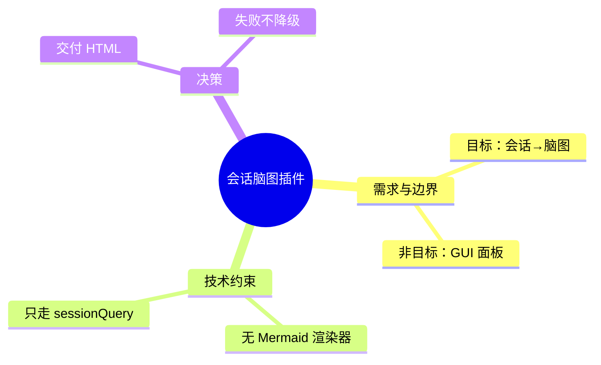

# DSH 会话脑图插件 `dsh-session-mindmap` 设计文档

- 版本：**v1.0（对应插件 0.2.0，M1/M2 已实现并通过真实会话验证）**
- 目标平台：DeepSeek Harness **0.2.0-rc.2**
- 发布形态：GitHub 开源（MIT）+ npm 可发布（包名 `dsh-session-mindmap`，实测未被占用）
- 本文只写**方案设计**：要做什么、约束来自哪里、为什么这么定、怎么验证。变更历史见 [CHANGELOG.md](./CHANGELOG.md)。

---

## 1. 定位与范围

| 项 | 结论 |
|---|---|
| 一句话定位 | 把一个 DSH 会话的核心内容整理成**可离线打开的自包含 HTML 脑图**，用于阶段复盘与对外交流 |
| 交付物 | 单个 HTML 文件（默认落在会话工作目录 `.dsh/mindmap/`），文件内自带导出 Markdown / Mermaid / PNG |
| 触发方式 | 手动后置触发：工具 `session_mindmap`（模型可调）+ 命令 `/mindmap`（人可直接调） |
| 插件形态 | **纯 Host 插件**：无 Client 半侧、无 GUI 面板、无构建链、无运行时依赖 |
| 生成方式 | **必走 LLM**（默认跟随宿主默认模型）；失败不静默降级 |
| 最大技术约束 | GUI 内没有任何脑图 / Mermaid 渲染器 → 图必须由生成的 HTML 自己渲染 |
| 最大工程要求 | 开源且方便他人理解 → 双语 README、单测、CI、MIT、`dsh-plugin` topic |

### 非目标（明确不做）

- GUI 右栏面板、对话内卡片、任何 `ctx.slots` 扩展；
- 会话结束自动生成、cron 批量、多会话汇总成一张图；
- 产物内容上传到任何远端服务。

> 会话行右键菜单属于 `ctx.slots` 扩展，因此同样在非目标内。它带来的"在会话里点开产物"已经由 DSH 原生交付物卡片覆盖（§5.5）。

---

## 2. 设计决策

| # | 决策 | 理由 |
|---|---|---|
| D1 | 主交付是**自包含 HTML**，不用 Mermaid 作为呈现路径 | 实测 GUI 无 mermaid / markmap 渲染器（§4.1），渲染必须自带 |
| D2 | 不直接读 session 文件，只走 `ctx.sessionQuery` | 日志是**多帧追加 zstd**（实测单会话 136+ 帧），自解析脆弱 |
| D3 | **不做 Client 半侧 / GUI 面板** | 自看存档用 HTML 足够；同时消掉"客户端打包预设不可得、`dsh.client` 字段口径不一致"这两个最大风险 |
| D4 | 零构建纯 ESM JS | 贡献者克隆即可改、即可装，不需要构建链；测试也不需要 DSH 在场 |
| D5 | 不碰 `ctx.settings` 服务 | 该 API 存在两代方言；补丁行的 `config` 已够用 |
| D6 | 维度默认 = 主题 / 结论 / 决策 / 待办 / 未决问题，**文件维度默认关** | 前五类回答"这个会话讲了什么"；文件清单是检索性问题，需要时再开 |
| D7 | 读 `readSurface`（模型表面事件）而非全量日志 | 最贴近"这个会话到底聊了什么"，且不依赖 log-only 事件的存在性 |
| D8 | 节点带 `refs.seq`，缓存保存独立的 JSON | 为"跳回原文"和"增量对比"留数据位；缓存 JSON 同时是可再渲染的数据源 |
| D9 | LLM 失败**不静默降级** | 一个"长得像脑图的目录树"比明确报错更误导人 |
| D10 | 预算必须自洽：prompt 要求的产出规模装得进 `maxOutputTokens` | 两个数字悄悄失配时，review 看不出来（§8 R1） |
| D11 | 两个语义不同的入口**不共用**带隐藏默认值的请求构造器 | 共用过一次，把"命令能弹窗、工具不能"的区别抹平了（§8 R4） |
| D12 | 措辞连续性：把上一次的节点 label 回喂 prompt | 模型对同一会话的粒度不稳定（实测 40 → 20 个节点），不约束措辞则增量对比是噪音 |

---

## 3. 开发规范来源

DSH **不随包发布**插件开发文档，`app.asar` 是归档、不能当目录读。规范因此来自两条腿：

1. **社区规范库**：`Wenaixi/dsh-plugin-dev`（发布/测试）、`omdsh-dev/dsh-plugin-dev`、`awesome-dsh-plugin` 的 CONTRIBUTING（收录要求）。接口细节一律标注出处，不照抄未验证的说法。
2. **本机实测**：`cordis_inspect_list` / `cordis_inspect_query` 拉宿主服务、事件、Slot 契约；读已安装插件的源码（`dsh-soul-md` 证明零构建手写客户端可行；`@michengai/dsh-archive-manager` 提供了 workspace 路由与信任判断的样板）。

---

## 4. 技术约束（实测结论）

### 4.1 渲染

GUI 里 **没有** mermaid / markmap 渲染器（对 `app.asar` 做字节检索证实：只有 shiki 高亮与 katex）。→ 图由产物 HTML 自己画（内联 SVG + 原生 JS）。

### 4.2 会话读取

- `ctx.sessionQuery.readSurface(id)` 返回**模型表面事件**：只有 `system/developer/user/assistant message` + `tool/result` 五类，**不含 `turn/start` / `turn/end`**（log-only）。
- 因此轮次边界只能靠 `assistant/message` / `tool/result` 自带的 `data.turn` + "用户消息在上一轮已有产出时开新块"两条信号。
- DSH 会把运行时上下文（`Current runtime context…`、`[MNEMON]…`）注入 user/message，每条约 800 字，摘要前必须剥离。
- 会话日志 `session.v4.jsonl.zstd` 是**多帧追加**的，`zstdDecompressSync` 只能解出第一帧 → 只能走服务。

### 4.3 模型调用

`ctx.llm.stream(GenerateOptions{ provider, model, messages, system, maxTokens, temperature, signal, sessionId })`；`purpose` 只认官方的 `'compaction' | 'session-title'`，本插件不冒充用途、不传该字段。provider/model 取自 `ctx.agentDefaultModel.currentSelection()`（跟随默认模型，配置保留覆盖位）。

### 4.4 Web 路由

- `/api/*` 是 Connection RPC 通道的地盘，插件注册在该前缀下的路由收不到请求（实测返回 SPA 的 404）；`prefix` 形态同样不生效。
- 可用形态是**exact 路由 + 查询参数**，并自己做 loopback + 同源（`sec-fetch-site`）校验；`ctx.connection.requestRejection` 只在报 403 时一票否决——**不能**用"缺它就跳过注册"当守卫，那会静默关掉功能。

### 4.5 呈现能力决定文案形式

- GUI 的**命令结果渲染纯文本，不解析 Markdown**；工具结果所在的位置才渲染 Markdown。
- 因此同一个 `summarize()` 输出两种形态：命令结果报告"已经做了什么"，工具结果才带 Markdown 链接。

### 4.6 交付物机制

DSH 原生的交付物卡片由事件驱动：在 `tools/result` **之后** `session.append("deliverables/presented", { turn, callId, files })`，其中 `turn` 取自 `ctx.sessionProjections.stateOf(session, "turnBoundary").lastTurn`（且有 `openTurnStartSeq !== null` 的前置），`files[].path` 相对会话工作目录。本插件照此实现，未引入任何客户端代码。注意交付物折叠是**按轮次**的，因此只有工具路径能产出卡片——命令执行不在任何轮次内。

---

## 5. 架构设计

### 5.1 数据流

```
① 目标会话解析   参数 sessionId | 'last' | 当前会话
        ↓
② 读取           ctx.sessionQuery.readSurface(id) → readTitleSnapshots(id)
        ↓
③ 规约（纯函数，无 LLM）
                 事件流 → TurnBlock[]：{ turn, 用户意图, 助手结论, 工具名[], 涉及文件[], 错误[] }
                 丢弃 reasoning / stream 分片 / developer、system 消息 / 超长工具输出
        ↓
④ 预算与分段     token 估算；超 maxInputTokens 则切 ≤ maxBlocks 段（Map-Reduce）
        ↓
⑤ 组织（LLM）    ctx.llm.stream(...) → 严格 JSON 脑图树；解析失败回喂重试 1 次
        ↓
⑥ 校验与裁剪     节点数 ≤ maxNodes、深度 ≤ maxDepth、去重、字符裁剪、保留 refs.seq
        ↓
⑦ 增量对比       与同一会话的上一次脑图做结构化 diff（不调模型）
        ↓
⑧ 渲染           MindMap JSON → 自包含 HTML（内联 CSS/JS，零外链）
        ↓
⑨ 缓存与返回     写 <hash>.json 与历史索引 index.json；返回摘要 + 交付物
```

### 5.2 模块结构（零构建）

```
dsh-session-mindmap/
├── package.json          # ESM；dsh.bundle.patch；files 白名单；peerDependencies 声明 DSH 版本区间
├── cordis.patch.yml      # - insert: [{ id: session-mindmap, name: dsh-session-mindmap }]
├── lib/
│   ├── index.js          # Host 半：Cordis 接线（工具 / 命令 / 路由 / 交付物监听）
│   ├── config-schema.js  # Schemastery Config（只依赖 schemastery，可独立测）
│   ├── plugin.js         # 工具与命令契约、请求构造器、helper（不含 DSH 依赖）
│   ├── pipeline.js       # 主流程（不含 DSH 依赖）
│   ├── extract.js        # 事件流 → TurnBlock[]（纯函数）
│   ├── budget.js         # token 估算与分段（纯函数）
│   ├── organize.js       # prompt 组装、LLM 调用、JSON 解析与重试
│   ├── schema.js         # 脑图 JSON 校验 + 裁剪 + 截断修复（纯函数）
│   ├── diff.js           # 两次脑图的结构化对比（纯函数）
│   ├── history.js        # 生成历史索引的读写与查询
│   ├── deliver.js        # 打开/在文件管理器中显示、交付物事件入队
│   ├── render-html.js    # 脑图 → 自包含 HTML（含内联渲染器）
│   ├── render-md.js      # 脑图 → Markdown / Mermaid（HTML 内导出按钮复用）
│   └── serve.js          # 产物只读路由（白名单 + 同源校验）
├── scripts/make-demo.mjs # 生成 examples/ 下的离线示例
├── tests/                # node:test，无需 DSH、无需网络
├── .github/workflows/    # CI：测试矩阵 + demo 一致性 + 清单与 README parity
├── examples/             # demo.html / .md / .mmd / .png
└── README.md / README.zh-CN.md / CHANGELOG.md / LICENSE
```

> 分层动机：除 `index.js` 之外**没有任何模块 import DSH**，因此九成测试可以在干净 checkout 上跑（`npm test` 不需要安装 DSH）。

### 5.3 工具契约 `session_mindmap`

| 参数 | 类型 | 说明 |
|---|---|---|
| `sessionId` | string | 目标会话 id；省略 = 当前会话，`last` = 最近一个 |
| `kinds` | string | 逗号分隔的维度，如 `topic,decision,todo`；默认 = 配置默认 |
| `focus` | string | 只围绕某个主题抽取 |
| `language` | string | `zh` / `en`，覆盖本次生成的语言 |
| `force` | boolean | 忽略缓存重新生成 |

输出：`sessionId / title / nodeCount / model / turns / calls / cached / htmlPath / viewPath / language / delta / addedCount / removedCount / outline`。

### 5.4 命令契约 `/mindmap`

```
/mindmap list                  # 列出最近会话的 id、标题、时间
/mindmap                       # 当前会话
/mindmap last | <sessionId>    # 历史会话
/mindmap --focus=主题 --kinds=topic,decision --lang=en --force
/mindmap --open | --reveal | --no-open
```

`list` 子命令是"给历史会话生成脑图"的入口：工具要的是 `sessionId`，而 GUI 只显示标题，没有这个入口就无从下手。

### 5.5 两种入口的差异（D11）

| 入口 | 是否弹窗 | 理由 |
|---|---|---|
| 命令 `/mindmap`（人打的） | **打开产物**：默认系统默认应用，`--reveal` 在文件管理器中选中，`--no-open` 只写文件 | 人既然敲了命令，就是想看图 |
| 工具 `session_mindmap`（模型调的） | **不弹窗**，改为写 `deliverables/presented` 留下原生交付物卡片 | 模型在任务中途调用，弹窗是干扰；卡片上自带打开/显示动作 |

两者各有一个请求构造器（`commandRequest` / `toolRequest`），`openMode` 的决策写在看得见的地方——**不要**再合回一个带隐藏默认值的公共包装器。

### 5.6 配置（Schemastery）

| 字段 | 默认 | 说明 |
|---|---|---|
| `provider` / `model` | 空 | 空 = 跟随 `ctx.agentDefaultModel` |
| `kinds` | 前五类 | `file` 默认不开（D6） |
| `language` | `zh` | 产物语言 |
| `maxInputTokens` | `24000` | 送模型的 transcript 预算 |
| `maxBlocks` | `8` | 超预算时最多分几段 |
| `maxNodes` / `maxDepth` | `80` / `4` | 裁剪上限 |
| `maxOutputTokens` | `8000` | **必须大于 prompt 要求的产出规模**（D10） |
| `temperature` | `0.2` | 结构化输出，取低 |
| `llmTimeoutMs` | `180000` | 单次调用超时 |
| `outputDir` | `.dsh/mindmap` | 相对会话工作目录 |
| `cache` | `true` | 按 `capturedThroughSeq` 命中 |
| `openAfterBuild` | `true` | 命令路径是否自动打开（工具路径不受影响） |
| `listLimit` | `10` | `/mindmap list` 显示条数 |

### 5.7 数据模型

```jsonc
{
  "title": "会话主题",
  "root": {
    "id": "n1", "label": "核心主题", "kind": "topic", "detail": "一句话概述",
    "refs": { "seq": [12, 48] },
    "children": [
      { "id": "n2", "label": "关键决策", "kind": "decision",
        "detail": "选 A 不选 B，因为…", "refs": { "seq": [31] }, "children": [] }
    ]
  }
}
```

`kind` ∈ `topic|conclusion|decision|todo|question|file`，决定配色与图例；`detail` 是补充说明；`refs.seq` 支撑"这个节点来自会话哪一段"（产物内悬停显示，将来可直接接深链）。

---

## 6. 提取策略（必走 LLM）

1. **规约（纯函数）**：按轮归并，每轮取 `用户消息（≤800 字）` + `助手正文（≤1200 字）` + 工具名列表 + 变更文件路径 + 错误摘要。
2. **单次调用**：transcript 在预算内时一次出全图；系统提示要求**严格 JSON**，给出各维度的判定标准与自检句，并要求产出规模不超过节点预算。
3. **Map-Reduce（长会话）**：超 `maxInputTokens` 时按轮切 ≤ `maxBlocks` 段，各出局部脑图，再把**局部脑图**（不是原文）归并成总图。成本上界 = `maxBlocks + 1` 次调用；归并输入超预算时先丢 `detail` 再截断。
4. **连续性（D12）**：若同一会话已有上一次的脑图，把它的节点 label 连同"同一话题沿用相同措辞"一起写进 prompt（单次与归并两条路径都加），保证增量对比可读。
5. **失败处理（D9）**：JSON 不合法 → 带校验错误回喂**重试 1 次**，且按失败类型换话术（截断就要求更小产出）；仍失败 → **不产出脑图**，返回明确错误（含 finish 原因与输出开头），并给出建议（换模型、加 `focus`、调大 `maxBlocks`）。

---

## 7. 产物、缓存与增量对比

- **产物**：`<sessionId>-<yyyymmdd-HHMM>.html`，单文件零外链（DSH 常在代理/离线环境）。
- **HTML 能力**：横向树布局、节点折叠、滚轮缩放、拖拽平移、关键字搜索、悬停显示来源段（`第 N 段 · seq a-b`）、复制大纲、导出 PNG / Markdown / Mermaid、自带深浅两套配色（不依赖宿主主题令牌）、**增量对比条与明细面板**。
- **缓存**：`<outputDir>/.cache/<hash>.json`，key = `sessionId + capturedThroughSeq + kinds + focus + model + language + maxNodes + maxDepth + promptVersion`；会话没变就秒出。缓存条目同时记录 `sessionId / capturedThroughSeq / generatedAt / language`。
- **历史索引**：`<outputDir>/.cache/index.json`（上限 500 条）。缓存文件名是内容哈希，要靠它反查"上一次"不可行，所以单独建索引。"上一次"的定义 = **同一会话、`capturedThroughSeq` 严格更小、其中最新的一条**；同一水位线重跑不算上一版。
- **增量对比**：对两棵节点树做结构化 diff（按归一化 label 匹配，忽略大小写/空白/中英标点），报新增 / 消失 / 层级调整 / 换主题；产物里给新增节点加绿色圈与 `+` 角标（用标记而非换色，避免抢走 `kind` 的色彩语义）。全程不调模型。
- **产物访问**：插件在宿主 web server 上注册一条 **exact 只读路由** `/session-mindmap/artifact?id=<16 位 hex>`，按进程内白名单回吐文件；未知 id、非法路径、非同源请求分别返回明确的 404 / 400 / 403。链接是**进程级**的（生成它的 DSH 实例还在运行才有效），因此纯文本路径始终一并给出。

---

## 8. 失败模式与设计规则

下表是从实际踩到的坑沉淀出的**规则**——不是事故记录（记录见 CHANGELOG）。这几条都有对应的守卫测试。

| # | 失败模式 | 规则 |
|---|---|---|
| R1 | prompt 允许 60 个节点（label 40 字 + detail 120 字 ≈ 4,300 token），而 `maxOutputTokens` 是 4000 → JSON 被硬截断，重试发同一指令继续撞墙 | **产出规模必须装进输出预算**；用最坏情况（节点数 × 满额字段）估 token 并写守卫测试；解析器要能救回被截断的 JSON（闭合未完成的字符串与容器）；错误信息必须带 finish 原因；重试按失败类型换话术 |
| R2 | 只认 `turn/start` 切轮 → 整场会话塌成一个块并被单轮预算静默截断（症状：脑图只覆盖开头） | 只用**表面事件**能拿到的信号切轮；夹具必须采用真实日志的形态（原夹具自己写了 `turn/start`，59 个用例全绿也没抓住这个 bug） |
| R3 | 用户消息里混入 DSH 注入的运行时上下文，每轮吃掉整个字符预算 | 摘要前剥离注入样板（整条是样板则丢弃，尾部样板按行首标记切掉） |
| R4 | 命令与工具共用一个请求包装器，包装器里写死 `openMode: "none"` → 命令的自动打开始终不生效 | 语义不同的入口各自构造请求，**隐藏默认值是最危险的一类共享** |
| R5 | 用"缺 `requestRejection` 就跳过注册"当守卫 → 功能被静默关掉 | 守卫失败要么降级到显式检查，要么报错；**不要静默不注册** |
| R6 | 同一个会话两次生成粒度不同（40 vs 20 节点） → 结构 diff 全是噪音 | 把上一次的措辞回喂 prompt 要求沿用（D12） |

---

## 9. 风险与未验证假设

| # | 风险 / 假设 | 现状 | 缓解 |
|---|---|---|---|
| A1 | GUI 不渲染 Mermaid | **已实测确认** | 主交付走自包含 HTML；Mermaid 仅作导出 |
| A2 | 超长真实会话的 Map-Reduce 质量 | **仅合成数据验证过**，真实长会话未跑 | `maxInputTokens` / `maxBlocks` 可调；`focus` 可缩小范围 |
| A3 | 历史会话（非当前会话）生成 | 代码与单测覆盖，**未对真实历史会话手工核对** | `/mindmap list` 给出 id 后可直接指定 |
| A4 | 写文件受 DSH 文件沙箱限制 | 会话策略为 `workspace-write` 时写 `~/.dsh` 会被拒 | 默认写会话工作区，路径可配 |
| A5 | LLM 输出非法 JSON | 常见 | 校验 + 回喂重试 + 截断修复 + 明确失败（D9、R1） |
| A6 | 版本门禁 | `peerDependencies` 与宿主版本不匹配会被**拒绝安装**，需人工豁免 | 声明对应版本区间；README 写明豁免命令 |
| A7 | `ctx.sessionQuery` / `ctx.webServer` 是可选依赖 | Inspect 标注 optional | `ctx.get(...)` 探测，缺失时明确报错，不静默 |
| A8 | 真实会话数据的隐私 | 单测规范要求 | **测试只用合成事件流**；真实会话只在本地手动验证，不入库、不打印内容 |

---

## 10. 里程碑与验收标准

**M1 — Host-only MVP**
- 交付：工具 `session_mindmap` + 命令 `/mindmap` + 规约/预算/校验/组织/渲染 + 缓存 + 双语 README + 单测 + CI + LICENSE。
- 验收：① 对当前会话生成 HTML，浏览器打开后折叠/缩放/搜索/导出可用；② 对历史会话（`sessionId` / `last`）同样可用；③ 二次执行命中缓存（秒出）；④ 长会话不超预算、不报错；⑤ 模型不可用或输出非法时**明确报错**，不产生"假脑图"；⑥ 单测全绿、`dsh plugin add` 装得上且启动无 PENDING。

**M2 — 打磨（已交付）**
- 交付物触达（命令自动打开 + 原生交付物卡片 + 只读路由）、prompt 判定标准与预算自洽、产物交互（来源段悬停、复制大纲、导出）、单次语言覆盖、分段归并稳健性。
- 验收：真机产物在浏览器中交互正常；英文产物逐项核对；截断类报错可自愈或给出可操作的诊断。

**M3 — 增量对比（v0.2.0，已交付）**
- 交付：同一会话的上一次脑图作为对比基线（历史索引 + 结构 diff + 产物高亮 + 结果摘要）、`/mindmap list`、措辞连续性。
- 验收：① 首次生成无对比、第二次给出正确的增删；② 对比不调模型；③ `list` 能列出可用的 id；④ 相关守卫测试全绿。

**明确不做**：GUI 面板 / 客户端半侧触点 / 自动批量 / 多会话汇总 / 版本间可视化 diff（已由增量对比覆盖）。

---

## 11. 开源与发布规范

### 11.1 仓库与元数据

- 仓库名 / 包名：`dsh-session-mindmap`。
- GitHub 必打 **`dsh-plugin`** topic；description 一句话、不含营销词。
- 收录要求（awesome-dsh-plugin CONTRIBUTING）：声明 `dsh.bundle` 清单、仓库创建满 1 天、条目写成 `data/plugins/<owner>__<repo>.yml` 一个 YAML 文件（**README 由脚本生成，不要手工编辑**）、描述必须与代码相符。

### 11.2 README 清单（中英两份，章节对齐）

安装命令 → 30 秒示例 → 配置项表格 → 工具与命令参数 → HTML 功能介绍与截图 → 产物目录与 `.gitignore` 提醒 → 故障排查 → 隐私说明（数据不出本机）→ 兼容性 → 贡献与测试命令 → License。

### 11.3 测试与 CI

- 框架：Node 内置 `node:test`（零依赖，契合零构建）。
- 四类用例：**注册契约**（`name`/`inject`/`apply` 形状、工具参数与输出）、**纯逻辑**（规约、预算、校验、diff、历史索引、渲染）、**接线**（真实 `@deepseek-ai/dsh-tools` 断言工具定义形状、请求构造器的 `openMode`）、**端到端**（假 ctx 跑完整链路，断言产物内容与交付物事件）。
- 隐私红线：不得把真实会话内容放进 fixtures、日志或 CI 输出。
- CI：Node 20.x / 22.x 双版本跑测试，另有两个独立 job——**清单校验**（打包内容/README parity/demo 与代码一致）。

### 11.4 对外写操作的纪律

对第三方仓库或公共注册表产生可见影响的操作（建仓、改可见性、push、npm publish、向收录列表提 PR），一律**先列出命令与影响、取得确认再执行**；提交内容本身要先本地自查能否通过对方的 CI。

---

## 12. 附录：产物形态

HTML 结构（横向树，示意）：

```
会话脑图：DSH 会话脑图插件设计                      2026-10-04 · 42 turns · 模型 deepseek-…
├─ 需求与边界
│   ├─ 目标：会话核心内容 → 脑图
│   └─ 非目标：GUI 面板 / 多会话汇总
├─ 技术约束 ⚠️
│   ├─ GUI 无 Mermaid 渲染器 → 自绘 HTML
│   └─ 会话日志多帧 zstd → 只走 ctx.sessionQuery
├─ 决策
│   ├─ 交付 HTML，不做右栏面板
│   └─ 失败不静默降级
└─ 未决问题
    └─ present 的 HTML 能否在 GUI 内预览
```

HTML 内导出的 Mermaid（给外部工具/GitHub 用）：



可交互示例见 [`examples/demo.html`](./examples/demo.html)（含增量对比面板）。
