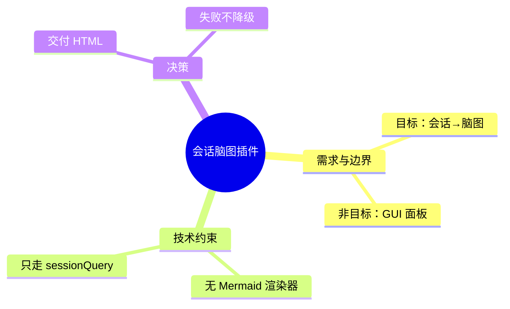

# DSH 会话脑图插件 `dsh-session-mindmap` 设计文档

- 版本：**v0.3（M1 已实现）**
- 目标平台：DeepSeek Harness **0.2.0-rc.2**（`dsh --version` 实测），profile `desktop`
- 日期：2026-10-04
- 发布形态：GitHub 开源（MIT）+ npm 可发布（包名 `dsh-session-mindmap` **未被占用**，实测 npm 404）

---

## 0. 实现状态（2026-10-04）

M1 已完成，代码与本文件同目录，`node --test` 59 个用例全绿（含用真实 `@deepseek-ai/dsh-tools` 跑的接线契约测试）。打包链路在**隔离 `DSH_HOME` 探针**里验证过：`add` → 组装树出现 `- id: session-mindmap` → 启动无报错 → `remove` 干净移除（不留悬空 bundle 条目）→ `add` 复原；版本门禁未触发，无需 `allow-version` 豁免。

与本文档设计的偏差（三处，都记在这里以免文档与代码对不上）：

| 偏差 | 说明 |
|---|---|
| 未实现 `mode: "outline"` 应急模式 | 工具最终只有 4 个参数：`sessionId` / `kinds` / `focus` / `force`。§5.4 提到的"应急结构目录"没有落地——理由见下文 D6，宁可失败也不产出易被误用的降级产物。若将来要，再补。 |
| 分层比设计多 | 除设计中的 `lib/*`，另拆出 `lib/config-schema.js`（只用 schemastery，可独立测）、`lib/plugin.js`（工具/命令契约与 helper，不含 DSH 依赖）、`lib/pipeline.js`（主流程，不含 DSH 依赖）。目的是让 90% 的测试在没有 DSH 的干净 checkout 上就能跑。 |
| 产物文件名到分钟 | `<sessionId>-<yyyymmdd-HHMM>.html`。同一分钟重复生成会覆盖同名文件（缓存命中时内容一致）；跨分钟各自留档。 |

另新增（设计里没有、但开源需要）：`examples/demo.{html,md,mmd,png}` 与 `scripts/make-demo.mjs`、`.github/workflows/ci.yml`、`LICENSE`、`.gitignore`。


---

## 1. 结论速览

| 项 | 结论 |
|---|---|
| 一句话定位 | 把一个 DSH 会话的核心内容整理成**可离线打开的自包含 HTML 脑图**，用于阶段复盘与对外交流 |
| 交付物 | 单个 HTML 文件（默认落在会话工作目录 `.dsh/mindmap/`），文件内自带导出 Markdown / Mermaid / PNG |
| 触发方式 | 手动后置触发：工具 `session_mindmap`（模型可调）+ 命令 `/mindmap`（人可直接调） |
| 插件形态 | **纯 Host 插件**：无 Client 半侧、无 GUI 面板、无构建链 |
| 生成方式 | **必走 LLM**（跟随默认模型）；失败不静默降级 |
| 最大技术约束 | GUI 内**没有**任何脑图/Mermaid 渲染器 → 图必须由我们的 HTML 自己渲染 |
| 最大工程要求 | 发布到 GitHub 且方便他人理解 → 双语 README、单测、CI、MIT、`dsh-plugin` topic |

---

## 2. 已定稿的决策（2026-10-04）

| # | 决策点 | 定稿 | 说明 |
|---|---|---|---|
| E1 | 交付形态 | **HTML 自己看/存档**，不做 DSH 右栏面板 | 定位是"后置的、可拿给人看的产物" |
| E2 | 触发时机 | **人工，阶段结束时生成一次**；不做自动、不做 cron 批量 | — |
| E3 | 内容维度 | 默认勾选：**主题、结论、决策与理由、待办、未决问题**；**涉及文件默认不勾选**（可选开启） | 对应 `nodeKinds` 配置项 |
| E4 | 输入口径 | **模型当前表面**（`sessionQuery.readSurface`） | 不读全量日志 |
| E5 | 生成方式 | **必须走 LLM**，跟随 `ctx.agentDefaultModel` 默认模型 | 不做静默的规则降级（见 §4.6） |
| E6 | 会话范围 | **当前会话 + 任意历史会话** | `sessionId` 参数 / `last` |
| E7 | 产物落盘 | **`<会话 cwd>/.dsh/mindmap/`** | 便于分享；需在 README 提醒加 `.gitignore` |
| E8 | 代码形态 | **纯 ESM JavaScript，零构建** | Host 侧手写，克隆即可改、即可装 |
| E9 | 许可与命名 | 包名/仓库名 **`dsh-session-mindmap`**，**MIT** | npm 名字实测未被占用 |
| E10 | 工程完备度 | **单测（`node:test`）+ GitHub Actions + 中英双语 README** | 便于他人参与与 awesome 收录 |

---

## 3. 开发规范从哪里来

### 3.1 规范来源

DSH 应用自身**不随包发布插件开发文档**：系统提示给的 checkout 路径（`app.asar/dsh/`）是 Electron 的 **asar 归档**，不能当目录读取（`ls` 报 Not a directory，`read` 报 BigInt 错误）。因此本设计依据两部分：

**（一）社区整理规范（第三方材料，按资料对待）**

| 来源 | 内容 | 用途 |
|---|---|---|
| [Wenaixi/dsh-plugin-dev](https://github.com/Wenaixi/dsh-plugin-dev) | `SKILL.md` + `references/*`（plugin-anatomy / tools / services / events / config / packaging / three-roles / remote-rpc / web-ui-slots / debugging）+ 6 个可运行示例 + `scaffold_plugin.mjs` / `validate_plugin.mjs` | 主规范，按 0.2.0-rc.2 编写 |
| [omdsh-dev/dsh-plugin-dev](https://github.com/omdsh-dev/dsh-plugin-dev) | 含 `references/publish.md`、`testing.md`、`build-pitfalls.md` | **发布与测试规范**（§9 主要依据） |
| [dsh-io/dsh-plugin-skill](https://github.com/dsh-io/dsh-plugin-skill) | `SKILL.md` | 交叉验证 |
| [awesome-dsh-plugin CONTRIBUTING](https://github.com/billLiao/awesome-dsh-plugin/blob/main/CONTRIBUTING.md) | 收录三条硬要求：`dsh-plugin` topic、`dsh.bundle` 清单、分类 PR | §9 收录规范 |
| [dshbase 教程](https://www.dshbase.com/blog/wx-deepseek-harness-plugin-development-tutorial/) | 首个插件教程 | 参考 |

**（二）本机运行时实测**：`cordis_inspect_query` 拉真实服务/插槽契约；读已装插件源码与 `package.json` 当模板；对 `app.asar` 做字节检索。下文标注了哪些结论来自实测。

### 3.2 会用到的基本规范

1. **Cordis 插件**导出 `name` / `inject` / `Config`（Schemastery）/ `apply(ctx, config)`；注册皆为可逆副作用，卸载自动回滚；`inject` 里声明但运行时不存在的服务 → **插件卡 PENDING、`apply` 不执行**。
2. **模型工具**用 `defineTool({ name, description, parameters, output, execute })` 注册到 `ctx.tools`（`inject: ['tools']`）。
3. **双面包（Bundle）**：`package.json` 写 `dsh.bundle.patch` 指向 `cordis.patch.yml`；补丁里 `- insert: [{ id, name, config, disabled }]`。**补丁的 `config` 是整行全量替换，不是深合并**。
4. **配置层级**：bundle patch → profile `cordis.patch.yml` → `$DSH_HOME/cordis.patch.yml` → `--patch` overlay，后层按行胜出。`settings.yaml` 已废弃。
5. **UI 只能走插槽**（本插件 v1 不需要）。
6. 本机实测的版本管理坑：`dsh plugin add` 装的是 latest 但**不含发布不足 24 小时**的版本；安装顺序必须 **add → 确认 node_modules 落地 → 才写 `dsh.profile.bundles`**；`peerDependencies` 与 DSH 版本不匹配会被**拒绝安装**（不是警告）。

---

## 4. 技术可行性的关键发现（本机实测）

### 4.1 GUI 里没有脑图/Mermaid 渲染器 ⚠️

对 `app.asar`（121MB，未压缩存储）做原始字节检索：

| 关键字 | 命中 | 说明 |
|---|---|---|
| `mermaid` | **3** | 全部无关：asciidoc 语法规则里的语言名、IANA MIME 表 `application/vnd.mermaid`、某依赖 README 示例 |
| `markmap` | 0 | 无 |
| `katex` | 672 | 有公式渲染 |
| `shiki` | 149 | 代码高亮 |

**结论**：往对话里输出 ` ```mermaid ` 只会显示成一段高亮代码块。所以脑图必须由**我们自己的 HTML 渲染**；Mermaid 只作为 HTML 内的一个导出按钮。

### 4.2 会话数据只能走 `ctx.sessionQuery`

会话落盘在 `~/.dsh/sessions/<cwd-slug>/session-<id>/session.v4.jsonl.zstd`（JSONL + zstd，仅追加）。

实测陷阱：直接读文件**不可靠**——一个 314,606 字节的会话文件里有 **136 个 zstd frame**（增量追加），`zlib.zstdDecompressSync` 只解出第一帧（只有 session header）。Node v22.22.3 确有该 API，但要自己迭代帧，脆弱且无保证。

→ 只走 Host 服务（Inspect 实测存在，方法齐全）：

| 方法 | 用途 |
|---|---|
| `readSurface(id)` | **默认输入**：当前模型表面（已剔除被替换/隐藏的事件）+ `capturedThroughSeq` |
| `readSession(id)` | 全量逻辑日志（备用） |
| `readTitle(id)` / `readTitleSnapshots(ids)` | 会话标题 |
| `listSessions()` | 会话清单（解析 `last`） |
| `listEvents(id)` / `readEvent({...})` | 轻量事件列表 / 单事件窗口（HTML 里"跳回原文"的潜力） |
| `traceSession(id)` | 父子会话血缘（subagent 树） |

事件模型：`SessionEvent = { type, seq, time, data }`；本插件关心 `turn/start`、`turn/end`、`user/message`、`assistant/message`（含 `stream`、`usage`）、`tool/call`、`tool/result`。

### 4.3 模型调用

`ctx.llm.stream(GenerateOptions)`：

```ts
GenerateOptions {
  provider, model, messages, system?, temperature?, maxTokens?, signal?, sessionId?,
  purpose?: 'compaction' | 'session-title'   // ← 本版本只认这两个值
}
```

- 不传 `purpose`（不冒充官方用途）。
- provider/model 来自 `ctx.agentDefaultModel.currentSelection()`（Inspect 实测：返回 detached 的 provider/model/可选 reasoning）。**当前定稿 = 跟随默认模型**，Config 保留覆盖位。

### 4.4 能力缺口检查

- `find_dsh_plugin` 搜 "mindmap / 脑图 / 思维导图" **无结果** → 没有现成插件可参考，自研。
- DSH 已有模型侧会话检索工具（`session_search` / `session_event_read` / `session_event_search` / `session_event_trace` / `session_trace`），它们是**给模型用的**；插件代码不依赖它们，直接调 `ctx.sessionQuery`。

---

## 5. 架构设计

### 5.1 数据流

```
① 目标会话解析   参数 sessionId | 'last' | 当前会话
        ↓
② 读取           ctx.sessionQuery.readSurface(id)
        ↓
③ 规约（纯函数，无 LLM）
                 事件流 → TurnBlock[]：{ turn, 用户意图, 助手结论, 工具名[], 涉及文件[], 错误[] }
                 丢弃 reasoning / stream 分片 / developer、system 消息 / 超长工具输出
        ↓
④ 预算与分段     token 估算；超 maxInputTokens 则切 ≤ maxBlocks 段（Map-Reduce）
        ↓
⑤ 组织（LLM）    ctx.llm.stream(...) → 严格 JSON 脑图树；解析失败回喂重试 1 次
        ↓
⑥ 校验与裁剪     节点数 ≤ maxNodes、深度 ≤ maxDepth、去重、字符裁剪、保留 refs.seq
        ↓
⑦ 渲染           MindMap JSON → 自包含 HTML（内联 CSS/JS，零外链）
        ↓
⑧ 缓存与返回     key = sessionId + capturedThroughSeq + model + promptVersion
```

### 5.2 工程结构（零构建）

```
dsh-session-mindmap/
├── package.json            # ESM；dsh.bundle.patch；files 白名单；peerDependencies 声明 DSH 版本区间
├── cordis.patch.yml        # - insert: [{ id: session-mindmap, name: dsh-session-mindmap, config: {...} }]
├── lib/
│   ├── index.js            # Host 半：inject / Config / 工具 / 命令 / 路由（如需）
│   ├── extract.js          # 事件流 → TurnBlock[]（纯函数，可单测）
│   ├── budget.js           # token 估算、分段策略（纯函数，可单测）
│   ├── organize.js         # LLM 调用、JSON 解析与重试、降级判定
│   ├── schema.js           # MindMap JSON 校验 + 裁剪（纯函数，可单测）
│   ├── render-html.js      # MindMap → 自包含 HTML（含内联渲染器）
│   └── render-md.js        # MindMap → Markdown / Mermaid（HTML 内导出按钮也复用）
├── tests/
│   ├── extract.test.js     # 合成事件流边界用例
│   ├── schema.test.js
│   └── register.test.js    # 插件注册契约（工具名/参数/输出形状）
├── .github/workflows/ci.yml
├── LICENSE                 # MIT
├── README.md               # 英文
├── README.zh-CN.md         # 中文
└── .gitignore
```

> **无 Client 半侧**（E1 定稿）：不写 `lib/client.js`、不声明 `dsh.client`、不碰 `ctx.slots`。这同时消掉了"M2 右栏面板要不要复刻官方客户端打包预设"的风险。

### 5.3 契约草案

**工具 `session_mindmap`**（`inject: ['tools']`）：

```jsonc
{
  "name": "session_mindmap",
  "description": "把会话的核心内容整理成自包含 HTML 脑图（主题/结论/决策/待办/未决问题）",
  "parameters": {
    "type": "object",
    "properties": {
      "sessionId": { "type": "string", "description": "目标会话 id；省略=当前会话，'last'=最近一个会话" },
      "kinds":     { "type": "array", "items": { "type": "string",
                     "enum": ["topic", "conclusion", "decision", "todo", "question", "file"] },
                     "description": "要抽取的维度，默认不含 file" },
      "focus":     { "type": "string", "description": "可选：只围绕某个主题抽取" },
      "force":     { "type": "boolean", "description": "忽略缓存重新生成" }
    }
  },
  "output": { /* sessionId, title, nodeCount, model, cached, htmlPath, outline(截断) */ }
}
```

**命令 `/mindmap`**：`/mindmap [sessionId|last] [--kinds=topic,conclusion,...] [--focus=…] [--force] [--open]`
——人可直接触发；`--open` 用 `ctx.subprocess` 调 `open`（macOS）打开产物。

**配置 `Config`（Schemastery，走补丁行 `config`）**：

| 字段 | 默认 | 说明 |
|---|---|---|
| `provider` / `model` | 空 | 空 = 跟随 `ctx.agentDefaultModel` |
| `kinds` | `[topic, conclusion, decision, todo, question]` | **`file` 默认不开**（E3） |
| `maxInputTokens` | `24000` | 送模型的 transcript 预算 |
| `maxBlocks` | `8` | 超预算时最多分几段 Map |
| `maxNodes` | `80` / `maxDepth` | `4` |
| `outputDir` | `<cwd>/.dsh/mindmap` | E7 |
| `cache` | `true` | 按 `capturedThroughSeq` 命中 |
| `openAfterBuild` | `false` | 生成后是否自动打开 |
| `language` | `zh` | 脑图节点语言（zh / en / 跟随会话） |

**脑图数据模型**：

```jsonc
{
  "title": "会话主题",
  "source": { "sessionId": "...", "sessionTitle": "...", "capturedThroughSeq": 137,
              "model": "…", "generatedAt": 1791047325644, "promptVersion": 1 },
  "root": {
    "id": "n1", "label": "核心主题", "kind": "topic", "detail": "一句话概述",
    "refs": { "seq": [12, 48] },
    "children": [
      { "id": "n2", "label": "关键决策", "kind": "decision",
        "detail": "选 A 不选 B，因为…", "refs": { "seq": [31] }, "children": [] }
    ]
  }
}
```

`kind` 决定配色与图标；`detail` 是悬停/展开的补充；`refs.seq` 支撑"点击节点跳回原文"（v1 在 HTML 内展示 seq 编号，不做跳转；将来接 Client 半侧或 DSH 深链时直接可用）。

### 5.4 "核心内容"的提取策略（必走 LLM）

1. **规约（纯函数）**：按 turn 归并，每轮取 `用户消息（≤800 字）` + `助手正文（≤1200 字）` + 工具名列表 + 变更文件路径 + 错误摘要。丢弃 reasoning、stream 分片、developer/system 消息、超长的工具输出正文。
2. **单次 LLM**：transcript 在预算内时一次调用出全图；系统提示要求**严格 JSON**（含 `kind` 与 `refs.seq`），并给出 6 个维度的枚举与产出示例。
3. **Map-Reduce（长会话）**：超 `maxInputTokens` 时按 turn 切 ≤`maxBlocks` 段，各出局部脑图，再把**局部脑图**（不是原文）归并成总图。成本上界 = `maxBlocks + 1` 次调用。
4. **失败处理（E5）**：JSON 解析失败 → 带校验错误回喂**重试 1 次**；仍失败 → **不产出脑图**，工具返回明确错误（模型不可用 / 上下文过长 / 输出不合法），并给出建议（换模型、加 `focus` 缩小范围、调大 `maxBlocks`）。
   → **不做静默的规则降级**：一个长得像脑图的目录树比失败更误导。
   → 仅供应急：`mode: "outline"`（或 `--outline`）产出**无模型的结构目录**，且产物标题与工具结果都**显著标注"未使用模型"**。默认永不自动走这条路。

### 5.5 产物与缓存

- 交付物：`<sessionId>-<yyyymmdd-HHMM>.html`（**单文件、零外链**，DSH 环境常在代理/离线场景）。
- HTML 能力：横向树布局、节点折叠、滚轮缩放、拖拽平移、关键字搜索、**导出 PNG / Markdown / Mermaid**、深浅两套配色（自带，不依赖宿主主题令牌）。
- 缓存：`<outputDir>/.cache/<hash>.json`，key 含 `capturedThroughSeq`；会话没变就秒出。缓存文件同时是"可再渲染"的数据源。

---

## 6. 关键设计决策与理由

| # | 决策 | 理由 |
|---|---|---|
| D1 | 不用 Mermaid 作为 GUI 呈现路径 | 实测 GUI 无 mermaid 渲染器（§4.1） |
| D2 | 不直接读 session 文件，只走 `ctx.sessionQuery` | 日志是**多帧追加 zstd**（实测 1 会话 136 帧），自解析脆弱 |
| D3 | **不做 Client 半侧 / GUI 面板** | E1 定稿 HTML 交付；顺带消掉客户端打包与字段口径不一致的风险 |
| D4 | 零构建纯 ESM JS | E8；本地 `dsh-soul-md` 已证明手写可行，贡献者克隆即可改 |
| D5 | 第一阶段不碰 `ctx.settings` 服务 | 该 API 存在两代方言（本地 `dsh-quick-toc` 源码里 `installSection` 与 `configure` 两条分支并存）；补丁行 `config` 已够 |
| D6 | LLM 失败不静默降级 | E5；避免产出"像脑图但不是脑图"的误导性产物 |
| D7 | 默认读 `readSurface` | E4；最贴近"这个会话的核心内容" |
| D8 | 节点带 `refs.seq` 与独立的缓存 JSON | 为将来的"跳回原文"和"增量对比"留数据位，避免返工 |

---

## 7. 非目标（v1 明确不做）

- GUI 右栏面板 / 对话内卡片 / 任何 `ctx.slots` 扩展；
- 会话结束自动生成、cron 批量、多会话汇总成一张图；
- 脑图版本间差异对比（"这个会话比上次多了什么"）；
- 脑图内容上传到任何远端服务。

---

## 8. 风险与未验证假设

| # | 风险 / 假设 | 现状 | 缓解 |
|---|---|---|---|
| R1 | GUI 不渲染 Mermaid | **已实测确认** | 主交付走自包含 HTML；Mermaid 仅作为 HTML 内导出 |
| R2 | `present` 交付的 HTML 在 GUI 内能否预览 | **未验证** | 工具结果直接给绝对路径；`--open` 走系统浏览器；README 写清"用浏览器打开" |
| R3 | 写文件受 DSH 文件沙箱限制 | 本会话策略为 `workspace-write`；写 `~/.dsh` 可能被拒 | 默认写会话工作区（E7），路径可配 |
| R4 | LLM 输出非法 JSON | 常见 | 校验 + 回喂重试 1 次 + 明确失败（D6） |
| R5 | 长会话成本 | 未知量级 | `maxInputTokens` / `maxBlocks` / 缓存三重闸门；`focus` 可缩小范围 |
| R6 | 版本门禁 | `peerDependencies` 与 DSH 版本不匹配会被**拒绝安装** | 声明 `>=0.2.0-rc.2 <0.3.0`；必要时 `allow-version` 豁免并写进 README |
| R7 | `ctx.sessionQuery` 是可选依赖 | Inspect 标注 optional | `ctx.get('sessionQuery')` 探测，缺失时明确报错，不静默 |
| R8 | 命令注册契约 | `ctx.commands.register(definition)` 的 `CommandDefinition` 形状未逐字段核对 | 实现时用 Inspect 拉 `commands` 契约后再写 |
| R9 | 真实会话数据的隐私 | 单测规范明确要求 | **测试只用合成事件流**；真实会话仅本地手动验证，绝不入库、不打印内容（§9.3） |

---

## 9. 开源与发布规范（E9 / E10）

### 9.1 仓库与元数据

- 仓库名 / 包名：`dsh-session-mindmap`（npm 实测未被占用）。
- **GitHub topic 必打 `dsh-plugin`**（awesome-dsh-plugin 收录硬要求之一）。
- description（≤80 字符，影响收录列表文案）：
  `DSH plugin: turn a session into a self-contained interactive HTML mind map.`
- 收录分类：awesome-dsh-plugin 的 **💬 Sessions & Messages**（`categories/sessions-messages.md`）。
- 收录三条件（CONTRIBUTING 原文）：仓库有 `dsh-plugin` topic、声明 `dsh.bundle` 清单（可 `dsh plugin add`）、PR 到正确分类。→ 本设计天然满足前两条。

### 9.2 README 清单（中英两份，内容对齐）

安装命令（`dsh plugin add dsh-session-mindmap` / 本地路径安装）→ 30 秒示例 → 配置项表格 → 工具与命令参数 → HTML 功能截图/GIF → 产物目录与 `.gitignore` 提醒 → 隐私说明（数据不出本机）→ 兼容性（DSH 0.2.0-rc.2）→ 贡献与测试命令 → License。

### 9.3 测试与 CI

- 框架：Node 内置 **`node:test`**（零依赖，契合"零构建"）。
- 三类用例：
  1. **注册契约**：`name` / `inject` / `apply` 形状 + 工具定义（名称、必填参数、枚举、`output`）。
  2. **纯逻辑**：`extract.js`（空会话、只有用户消息、工具报错、超长文本截断）、`budget.js`（分段边界）、`schema.js`（缺字段、超深、超节点数、非法 JSON）。
  3. **端到端（可选、opt-in）**：用一个假的 `ctx`（`llm` 返回固定 JSON、`sessionQuery` 返回合成事件）跑完整生成链路，断言产物 HTML 含预期节点。
- **隐私红线**（来自测试规范）：不得把真实会话内容放进 fixtures、日志或 CI 输出；真实会话只做本地手动验证。
- CI：`.github/workflows/ci.yml` — Node 22，`npm test` + 对示例配置跑一次插件清单校验（可选接社区 `validate_plugin.mjs` 思路）。

### 9.4 交付前闭环清单

- [ ] clean checkout 可运行（`lib/` 随仓库提交，无构建步骤）
- [ ] `package.json` 的 `main` / `exports` / `files` 指向真实存在的文件，`files` 含 `lib` 与 `cordis.patch.yml`
- [ ] 补丁 row id（`session-mindmap`）不与官方核心 row 冲突
- [ ] `peerDependencies` 只声明真正用到的宿主包，版本区间对应 0.2.0-rc.2
- [ ] 本地 `dsh plugin add` 能装、能启、`--dump-config` 能看到该行（注意 `--dump-config` 只验 YAML，**不代表能启动**）
- [ ] 单测全绿
- [ ] 中英 README 齐、description 与 topic 齐
- [ ] 完整跑一次：对一条真实会话生成 HTML 并用浏览器打开验证交互

### 9.5 需要你显式授权的动作（D9 授权门）

以下操作我**不会擅自执行**，会先把命令与影响列出来给你确认：

1. `gh repo create` / 改仓库可见性；
2. `git commit` / `git push`（会先给待推送 diff 摘要与目标分支）；
3. `npm publish`（需要 npm 令牌与你的确认）；
4. 向 awesome-dsh-plugin 提 PR。

---

## 10. 里程碑与验收标准

**M1 — Host-only MVP（本次要做的）**
- 交付：工具 `session_mindmap` + 命令 `/mindmap` + `extract/budget/schema/organize/render-html` + 缓存 + `outline` 应急模式 + 双语 README + 单测 + CI + LICENSE。
- 验收：
  1. `/mindmap` 对**当前会话**生成 HTML，浏览器打开后折叠/缩放/搜索/导出可用；
  2. 对**历史会话**（`sessionId` / `last`）同样可用；
  3. 二次执行命中缓存（秒出）；
  4. 一条 100+ 事件的会话不超预算、不报错；
  5. 模型不可用/输出非法时**明确报错**，不产生"假脑图"；
  6. 单测全绿；`dsh plugin add` 装得上、启动无 PENDING。

**M2 — 打磨（M1 验证后再定）**
- 会话很长时的分段质量调优、`focus` 主题模式、HTML 交互细化（跳回原文展示、导出 PNG 质量）、英文节点语言。
- 若届时确实想要 GUI 面板，再单开设计——**不并入 M1**。

---

## 11. 附：产物形态示例（手写示意，非实测产出）

HTML 结构（横向树）：

```
会话脑图：DSH 会话脑图插件设计                      2026-10-04 · 42 turns · 模型 deepseek-…
├─ 需求与边界
│   ├─ 目标：会话核心内容 → 脑图
│   └─ 非目标：GUI 面板 / 多会话汇总
├─ 技术约束 ⚠️
│   ├─ GUI 无 Mermaid 渲染器 → 自绘 HTML
│   └─ 会话日志多帧 zstd → 只走 ctx.sessionQuery
├─ 决策
│   ├─ 交付 HTML，不做右栏面板
│   └─ 失败不静默降级
└─ 未决问题
    └─ present 的 HTML 能否在 GUI 内预览
```

HTML 内导出的 Mermaid（给外部工具/GitHub 用）：


