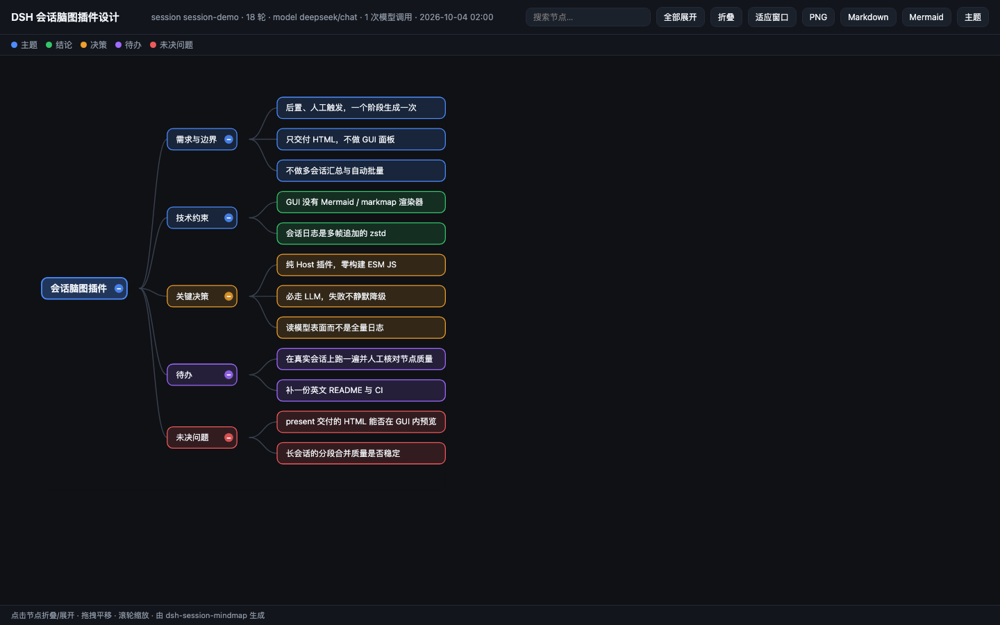

# dsh-session-mindmap

[English](README.md) · **简体中文**

[](https://github.com/jianyuepei/dsh-session-mindmap/actions/workflows/ci.yml)

**把一个 DSH 会话变成一张自包含的 HTML 脑图。**

一个阶段结束时执行 `/mindmap`，得到一个可以直接打开、发给别人、或存档的文件：这场会话聊了什么主题、得出了什么结论、做了哪些决策以及为什么、还剩什么待办和未决问题。文件不依赖网络、字体和 CDN，双击就能看。



## 为什么做这个

长会话是很差的交付物：真正值钱的东西（决定了什么、否掉了什么以及为什么、还有什么没定）散落在几十轮对话里，回头重读一遍基本不划算。这个插件产出的是"一页版本"。

它刻意**不是** GUI 面板、不是自动化、也不是知识库：你让它跑它才跑，产出**一个**文件，然后结束。

## 安装

```sh
# 从 npm 安装
dsh plugin add dsh-session-mindmap

# 从本地目录安装（开发用）
dsh plugin add /path/to/dsh-session-mindmap

# 从 git 安装（lib/ 已随仓库提交，不触发任何构建）
dsh plugin add github:jianyuepei/dsh-session-mindmap
```

要求 DSH **0.2.0-rc.2**（`dsh --version`）。声明的 peer 版本与当前 DSH 不匹配时，插件管理器会**直接拒绝安装**；能升级就升级，别急着用 `allow-version` 绕过。

## 用法

让模型去调用：

> 把这个会话整理成脑图

或者直接给工具传参：

```
session_mindmap
  sessionId?  "last" 或某个会话 id；省略即当前会话
  kinds?      逗号分隔：topic,conclusion,decision,todo,question,file
  focus?      只整理某一个主题
  force?      忽略缓存，重新调用模型
```

或者用命令——它不会为了"要不要生成"再花一轮模型：

```
/mindmap                       # 当前会话
/mindmap last                  # 最近一个会话
/mindmap session-abc --open    # 指定会话，生成后打开
/mindmap --focus=发布方案       # 只整理一个主题
/mindmap --kinds=topic,file    # 把涉及的文件也带上
```

命令是推荐入口：不想为"请求本身"再花一轮模型时，它照样能跑。

## 产物

```
<会话工作目录>/.dsh/mindmap/
├── <sessionId>-<yyyymmdd-HHMM>.html   # 交付物
└── .cache/<hash>.json                 # 脑图数据 + 导出文本，按会话状态缓存
```

* **HTML 是自包含的**：没有 CDN、没有网络字体、没有图片、没有任何上报，脑图用内联 SVG 画，离线可用。
* **交互**：点节点折叠/展开、拖拽平移、滚轮缩放、搜索高亮，工具栏可导出 PNG / Markdown / Mermaid。
* **缓存**：key 由会话已捕获的事件序号、启用的维度、focus 和模型组成。会话没变时直接命中缓存，完全不调模型；`force: true`（或 `--force`）可强制重算。
* **重新生成**会写一个新的带时间戳的文件，旧快照不会被覆盖。不想提交的话把 `.dsh/` 加进 `.gitignore`。

## 配置

配置写在插件行上（profile 的 `cordis.patch.yml`）——**补丁是整行替换而非深合并**，所以要改几个键就得把需要的键都写全：

```yaml
- id: session-mindmap
  name: 'dsh-session-mindmap'
  config:
    language: zh
    maxNodes: 120
```

| 键 | 默认值 | 说明 |
| --- | --- | --- |
| `provider` / `model` | 空 | 留空即跟随 Agent 默认模型；生成频繁的话可以指定一个便宜模型。 |
| `kinds` | `topic, conclusion, decision, todo, question` | 抽取维度；加 `file` 会把会话涉及的**文件**也整理进去。 |
| `language` | `zh` | 节点语言：`zh` 或 `en`。 |
| `maxInputTokens` | `24000` | 单次模型调用的 transcript 预算。 |
| `maxBlocks` | `8` | 长会话最多分几段生成，另加一次合并调用。 |
| `maxNodes` / `maxDepth` | `80` / `4` | 对模型返回结果做的节点数与层数上限。 |
| `maxOutputTokens` / `temperature` | `4000` / `0.2` | 单次生成的采样参数。 |
| `llmTimeoutMs` | `180000` | 单次调用超时。 |
| `outputDir` | `.dsh/mindmap` | 相对会话工作目录；也接受绝对路径。 |
| `cache` | `true` | 会话没变时复用上次结果。 |
| `openAfterBuild` | `false` | 生成后用系统浏览器打开。 |

## 实现要点

```
sessionQuery.readSurface(id)        模型实际看到的上下文
        ↓  extract.js               事件流 → 逐轮区块（纯函数）
        ↓  budget.js                token 估算 → 1 次调用，或 ≤maxBlocks + 1 次（纯函数）
        ↓  organize.js              ctx.llm.stream → 严格 JSON，失败回喂重试一次（纯函数）
        ↓  schema.js                强制转换、裁剪、去重（纯函数）
        ↓  render-html.js           自包含 HTML + 内联 SVG 渲染器
   <工作目录>/.dsh/mindmap/*.html
```

有三个决定值得单独说明，因为它们通常是评审必问的：

* **不用 Mermaid 呈现。** DSH 的 Web GUI 里没有任何图形渲染器（没有 Mermaid、没有 markmap——这是扫描 app 包实测的），所以 ```` ```mermaid ```` 代码块只会以纯代码显示。图由生成的文件自己画；Mermaid 只作为**导出格式**，给能渲染它的工具用。
* **会话只通过 `ctx.sessionQuery` 读。** 落盘日志是**多帧追加**的 zstd（实测一个会话文件里有 136 帧），直接解压只能拿到第一帧。服务是唯一受支持的来源，而 `readSurface` 最接近"这场会话到底聊了什么"。
* **模型失败就是失败，不做兜底。** 重试一次后仍拿不到可用 JSON，就直接报错，而不是写出一个**看起来像**脑图的目录树——那种产物会被当成真的脑图用。

## 隐私

* 插件通过宿主服务读取会话，并把 transcript 发给**你已经配置好的模型**，除此之外不发往任何地方。
* 产物写在会话自己的工作目录里。
* 测试用例里**没有任何真实会话内容**，全部是合成数据。这条请继续保持。

## 兼容性

| | |
| --- | --- |
| DSH | `0.2.0-rc.2`（更低版本会被插件管理器拒绝） |
| Node | `>= 20.18` |
| Profile | desktop / web 均可（纯 Host 插件，没有客户端 bundle） |
| 构建 | 无——`lib/` 是直接提交进 git 的纯 ESM |

## 开发

```sh
npm install          # 只声明一个开发镜像包（schemastery），DSH 包作为 peer 自动装进来
npm test             # node:test，77 个用例，不联网、不需要装 DSH
npm run demo         # 重新生成 examples/demo.{html,md,mmd}
```

测试分三层，中间那层是关键：

1. **纯逻辑**——`extract`、`budget`、`schema`、`render-*`：不碰宿主、不做 IO。
2. **接线契约**——`tests/index.test.js` 用真实的 `@deepseek-ai/dsh-tools` 跑一遍 `apply`，证明注册的工具能通过 schema 编译与参数校验。DSH 包取不到时会**跳过**而不是失败，离线环境照样能跑其余用例。
3. **全链路**——`tests/pipeline.test.js` 用假宿主 + 预置模型输出 + 临时目录，把"读 → 组织 → 渲染 → 落盘"整条跑通。

```
lib/index.js          Cordis 接线：Config、工具、命令
lib/config-schema.js  Schemastery schema（用真实 peer 测过）
lib/plugin.js         不含 DSH 依赖的宿主接缝：工具/命令契约、各类 helper
lib/pipeline.js       读 → 规约 → 组织 → 渲染 → 落盘（不含 DSH 依赖）
lib/extract.js        事件流 → 逐轮区块
lib/budget.js         token 估算与分段
lib/organize.js       prompt、流式收集、严格 JSON 解析、Map-Reduce
lib/schema.js         脑图数据模型：解析、转换、裁剪
lib/render-md.js      Markdown / Mermaid / 大纲
lib/render-html.js    自包含交付物
scripts/make-demo.mjs 重新生成 examples/
```

## 参与贡献

欢迎提 issue 和 PR，三条底线：

* 保持**纯 Host、零构建**——不加客户端半侧、不引入打包器、不加运行时依赖；
* 测试和 issue 里不要出现真实会话内容；
* **[README.md](README.md) 与本文件保持同步**——两者是同一份文档的两个语言版本，不是两份文档。

提交 PR 前请跑 `npm test` 和 `npm run demo`；CI 会检查这两步，并且如果 `examples/` 过期会直接失败。

## 许可

MIT

---

[⬆ 回到顶部](#dsh-session-mindmap) · [English](README.md)
